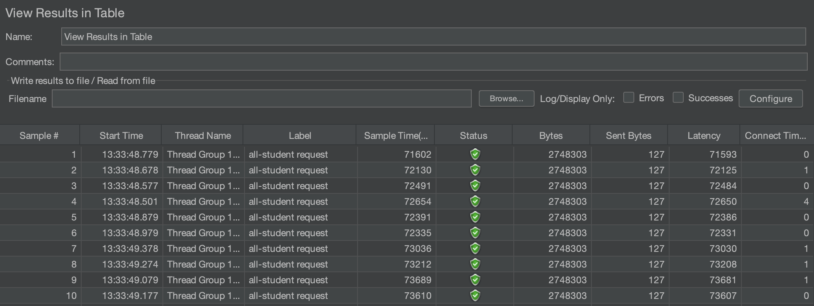
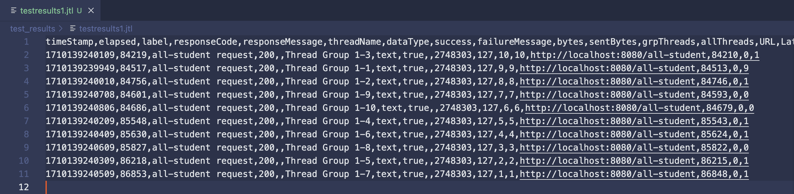
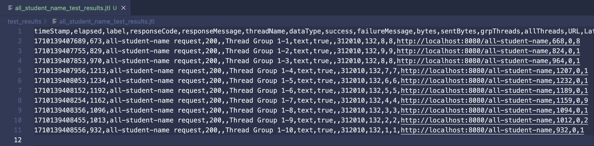
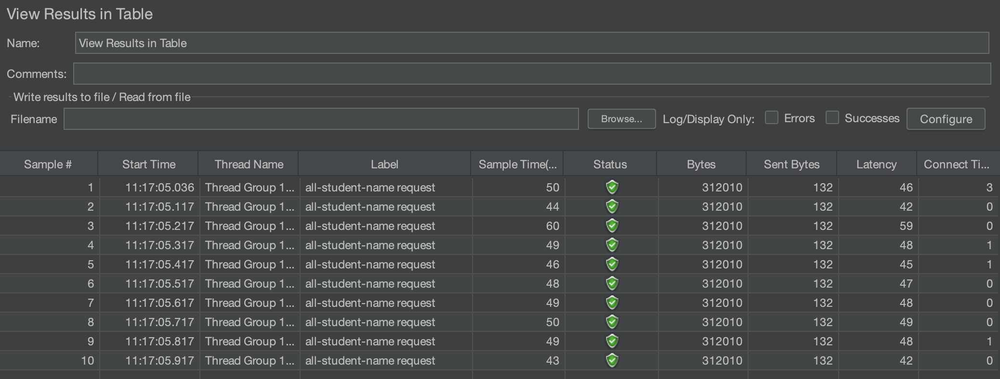
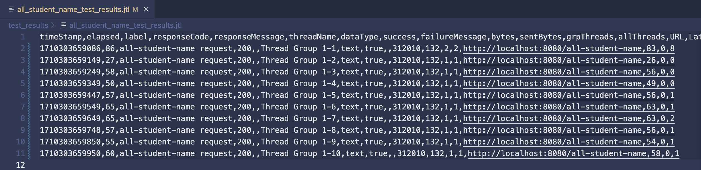
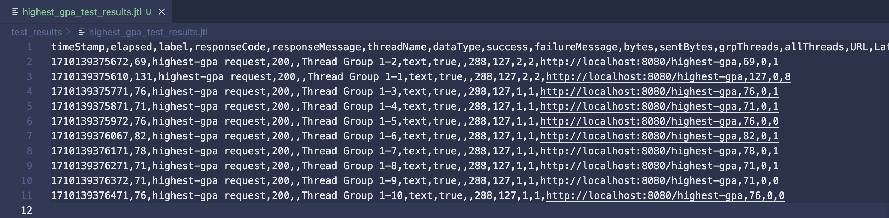
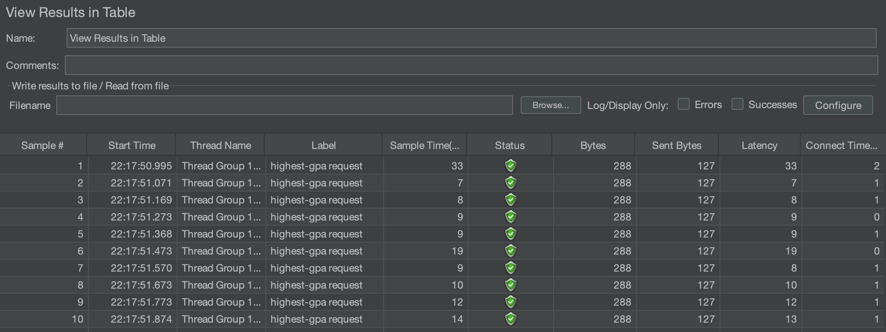
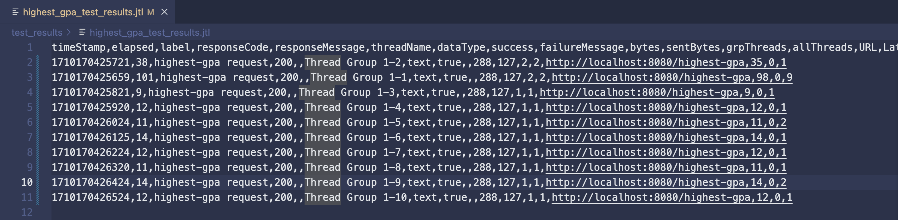

# exercise-profiling

## Reflection
1. Performance Testing melakukan pengukuran terhadap sebuah sistem dengan cara mensimulasikan penggunaan sistem tersebut dalam suatu workload, sedangkan Profiling melakukan pengukuran terhadap operasi internal sebuah aplikasi, seperti lama waktu pemanggilan sebuah method. Dalam kata lain, performance testing mengukur performa sebuah sistem sebagai satu kesatuan, sedangkan profiling mengukur performa setiap komponen dalam sebuah sistem.

2. Profiling mengukur performa setiap method dalam sebuah aplikasi. Hasil pengukuran setiap method tersebut sangat membantu saya dalam mengetahui method apa saja yang memakan banyak waktu dalam pemanggilannya.

3. Ya, fitur-fiturnya seperti flame graph dan timeline cukup membantu saya dalam menemukan method dengan waktu eksekusi yang lama.

4. Saya sempat mengalami kesulitan memahami API JPARepository untuk melakukan query terhadap database. Saya mengatasi kesulitan tersebut dengan cara membaca dokumentasi Spring Data JPA dan melakukan query SQL manual menggunakan anotasi `@Query` pada method `StudentRepository.findAllName`.

5. IntelliJ Profiler terintegrasi dengan IntelliJ IDEA sehingga profiling dapat dilakukan dalam IDE tersebut saja, tanpa harus menggunakan program tambahan. Selain itu, antarmuka IntelliJ Profiler cukup ramah pengguna sehingga dapat meningkatkan produktivitas pengguna dalam melakukan profiling.

6. Biasanya, masalah ini timbul saat memanggil sebuah method untuk pertama kalinya. Java menggunakan Just-In-Time compiler sehingga memungkinkan sebuah method untuk di-compile saat method tersebut pertama kali dipanggil. Hal tersebut tentu menimbulkan sedikit inkonsistensi dalam pengukuran performa. Oleh karena itu, saya memastikan untuk mengakses endpoint yang digunakan untuk memanggil sebuah method setidaknya sekali sebelum melakukan performance testing dan profiling.

7. Saya memastikan ukuran total bytes yang dikirimkan sebagai response sebelum dan sesudah optimisasi sama. Selain itu, saya juga memastikan data response sebelum optimisasi sama dengan data response setelah optimisasi.

## Images

### /all-student Test Results

Before Optimization

After Optimization

### /all-student-name Test Results

Before Optimization

After Optimization

### /highest-gpa Test Results

Before Optimization

After Optimization

 

Berdasarkan image yang tertera, terlihat bahwa sample time & time elapsed sistem sebelum dan sesudah optimisasi berkurang drastis walaupun memiliki ukuran bytes yang sama. Dengan demikian, saya menyimpulkan bahwa terdapat peningkatan pada pengukuran JMeter berupa pengurangan waktu respons terhadap sebuah request.
